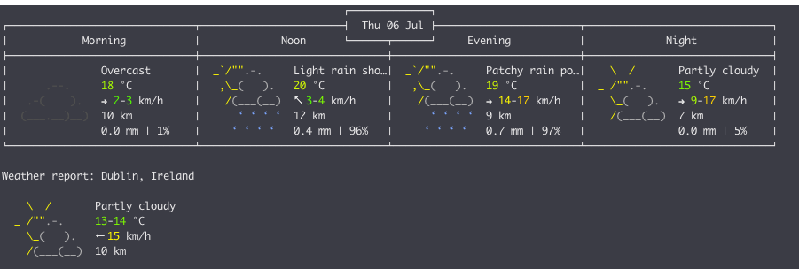
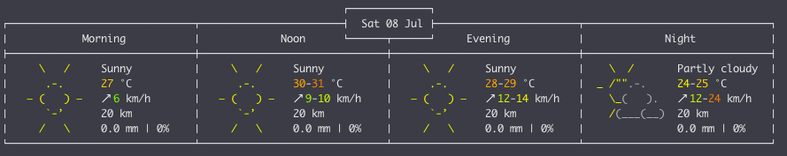

# Command line weather report using http://wttr.in


Provides a way to fetch weather report and parse into multiple reports, see below.

### Clone the repository
```bash
git clone https://github.com/StephenFox1995/wttrcli
```

### Use Package the project, go to project root and run:
```bash
mvn package
```

Alternatively, use the provided install script to run the package command and copy the jar to /usr/local/bin:
```bash
./install.sh
```

### To run
```bash
java -jar target/wttrcli-1.0.jar <options>
```

Alternatively, if you ran the install.sh above, the following command will be available:
```bash
wttrcli <options>
```

### The following options can be used:
```
--Usage--
	[l, location]	: The location to fetch the weather report.
	[o, option]	: An option for parsing the report, can be any of the following: 
                            all, tomorrow, live, aftertomorrow
```

### Examples
```bash
java -jar target/wttrcli-1.0.jar -l Dublin -o all
```


```bash
java -jar target/wttrcli-1.0.jar -l Dublin -o live -o tomorrow
```


```bash
java -jar target/wttrcli-1.0.jar -l Madrid -o aftertomorrow
```


## TODO: 
- Add install script for command line